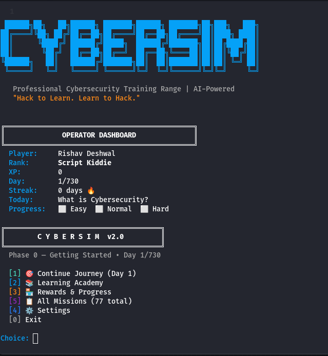

<p align="center">
  
</p>

# 🎮 CyberSim v2.0: AI-Powered Cybersecurity Training Range

CyberSim is a standalone, local, and fully offline-capable cybersecurity training simulator designed to take you from a complete beginner (Script Kiddie) to an advanced Red/Blue team operator. Inspired by industry-standard certifications (CEH, PNPT, OSCP, CRTO) and platforms like HackTheBox and TryHackMe, CyberSim provides a **730-day scheduled curriculum** featuring 77 unique, repeatable missions with dynamic difficulty scaling.

Built entirely in Python for Kali Linux, CyberSim leverages local LLMs (via Ollama) to provide an interactive **AI Mentor** and a rigorous **AI Defender** that fights back during live Docker lab engagements.

---

## ✨ Key Features

- **🎓 730-Day Zero-to-Hero Curriculum**: A structured, phase-based roadmap spanning 2 years of daily learning.
- **📚 77 Unique Missions**: Covers everything from basic networking to Buffer Overflows, Active Directory exploitation, SOC Log Analysis, and Advanced EDR Evasion.
- **📈 Dynamic Difficulties (Easy / Normal / Hard)**: Every mission scales. Easy holds your hand; Hard drops you into CRTO/OSEP-level expert tasks with active defense.
- **🧠 Local AI Mentor**: Stuck on a flag? Ask the local AI Mentor (powered by Llama 3/Mistral via Ollama) for contextual hints based on your exact mission and difficulty.
- **🛡️ Active AI Defender**: In "Normal" and "Hard" lab modes, an AI Defender actively monitors your Docker containers, blocking IP addresses, killing reverse shells, and implementing firewall rules if you aren't stealthy.
- **🐳 Seamless Docker Integration**: Labs spin up local vulnerable containers automatically. Flags are dynamically generated and injected to prevent cheating.
- **🏫 Learning Academy**: A built-in repository of 120+ curated free resources (videos, PDFs, external labs) mapped to your current phase.
- **🏪 XP & Reward Shop**: Earn XP by completing missions and use it to unlock aesthetic terminal themes, hints, and exclusive external course resources.
- **📝 Monthly Knowledge Assessments**: Mandatory quizzes every 30 days to ensure you're actually retaining knowledge.

---

## 🛠️ Installation & Requirements

CyberSim is built for **Kali Linux** or an equivalent penetration testing distribution.

### Prerequisites
1. **Python 3.10+**
2. **Docker & Docker Compose** (for live vulnerable lab environments)
3. **Ollama** (for the AI Mentor and Defender)

### Quick Start
```bash
# 1. Clone the repository
git clone https://github.com/yourusername/cybersim.git
cd cybersim

# 2. Start the Ollama service (ensure your preferred model is pulled, e.g., llama3)
ollama serve &

# 3. Launch CyberSim
python3 gamemaster.py
```

---

## 🗺️ The Roadmap (Phases 0-8)

1. **Phase 0: Getting Started** - Cybsersecurity fundamentals, Linux, Networking basics.
2. **Phase 1: Foundation (Days 7-30)** - Networking, Linux CLI mastery, Web basics, BASH scripting.
3. **Phase 2: Core Offensive (Days 31-90)** - Nmap, Burp Suite, Metasploit, password cracking, basic privilege escalation.
4. **Phase 3: Advanced Offensive (Days 91-180)** - Buffer overflows, Active Directory, Web App Pentesting.
5. **Phase 4: Defensive & Blue Team (Days 181-270)** - SOC analysis, Splunk, SIEM, DFIR, Malware Analysis.
6. **Phase 5: Red Team Ops (Days 271-400)** - EDR evasion, C2 frameworks (Sliver/Cobalt Strike), advanced pivoting.
7. **Phase 6: Cloud & AppSec (Days 401-500)** - AWS/Azure security, DevSecOps, container breakouts.
8. **Phase 7: Specialization (Days 501-600)** - Exploit development, reverse engineering, kernel exploitation.
9. **Phase 8: Capstone & Career (Days 601-730)** - Mock interviews, HTB/THM mastery, tool development, portfolio building.

---

## 📂 Project Structure

```text
cybersim/
├── gamemaster.py           # The main entry point and operator dashboard
├── core/
│   ├── academy.py          # Learning academy and resource management
│   ├── ai_agent.py         # LLM interaction layer (Ollama)
│   ├── defender.py         # The AI Defender thread for active response
│   ├── mentor.py           # Context-aware hint generator
│   ├── mission_runner.py   # UI rendering and flag submission loop
│   ├── mission_data.py     # Mission definitions (Phases 0-2 & 5-8)
│   ├── mission_data_stage34.py # Mission definitions (Phases 3-4)
│   ├── rewards.py          # XP shop, theme unlocks, purchase handling
│   ├── state.py            # Save file management (player progress)
│   └── ui.py               # Animations, banners, terminal graphics
├── db/
│   ├── academy_courses.json# Links to 120+ external learning materials
│   └── reward_shop.json    # Store inventory (themes, tools, courses)
└── targets/                # Dockerfiles for vulnerable lab environments
```

---

## 🤝 Contributing

Contributions are heavily encouraged! To add new missions:
1. Define the mission in `core/mission_data.py` with `easy`, `normal`, and `hard` blocks.
2. If it's a lab, create a vulnerable Docker container in `targets/` and link the image name.
3. Submit a Pull Request.

---

## 📜 License

This project is open-source and available under the [MIT License](LICENSE).

---
*Hack to Learn. Learn to Hack.*
